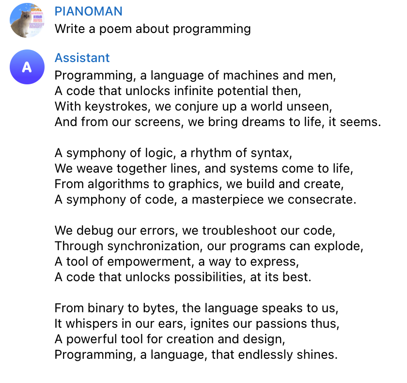

# chatgpt_telegram_bot
A telegram bot that can talk with you like chatGPT.

Before run this demo:

- Get [openai key](https://platform.openai.com/account/api-keys) and export in your environment:
```
export MY_OPENAI_API_KEY="your key here"
```

- Get [telegram bot token](https://core.telegram.org/bots#how-do-i-create-a-bot) with botfather and export it in your evnironment:
```
export MY_BOT_TOKEN="your token here"
```

- python version > 3.7

- Install [python-telegram-bot](https://github.com/python-telegram-bot/python-telegram-bot) and [openai](https://github.com/openai/openai-python):

```
pip install python-telegram-bot --upgrade

pip install openai --upgrade
```

Run it in tmux or in the background:
```
python bot.py
```

Try to talk with the bot created by botfather.




